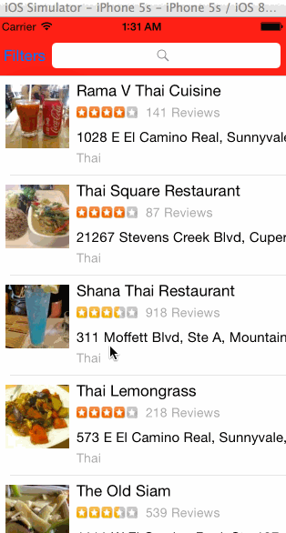

# Yelp Search Assignment

Time spent: 10+ hours

Completed user stories:

 * [x] Table rows should be dynamic height according to the content height
 * [x] Custom cells should have the proper Auto Layout constraints
 * [x] Search bar should be in the navigation bar (doesn't have to expand to show location like the real Yelp app does).
 * [x] Filters organized in section
 * [x] Used UISwitch for on/off states
 * [x] Clicking on the "Search" button should dismiss the filters page and trigger the search w/ the new filter settings.
 
 
